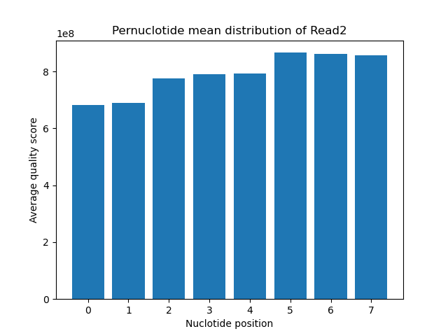
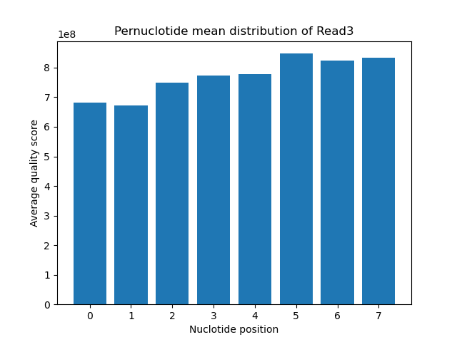
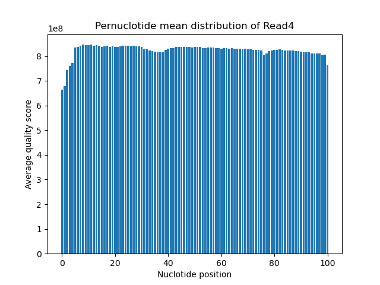

# Assignment the First

## Part 1
1. Be sure to upload your Python script. Provide a link to it here:[phyton_script](Part_1.py)[sbach_script](Part1sbach.sh)

| File name | label | Read length | Phred encoding |
|---|---|---|---|
| 1294_S1_L008_R1_001.fastq.gz | read1 | 101 | Phred33+ |
| 1294_S1_L008_R2_001.fastq.gz | index1 | 8 | Phred33+ |
| 1294_S1_L008_R3_001.fastq.gz | index2 | 8 | Phred33+ |
| 1294_S1_L008_R4_001.fastq.gz | read2 | 101 | Phred33+ |

2. Per-base NT distribution
    1. Use markdown to insert your 4 histograms here.![read1barplt](Read1.png)
    2. For both index and biological read I chose a min of phred 30 (1 in 1000). Since index reads are used to identify which sample belongs to which read we should have a higher expectation of quality to lower the chance of                 misidentifying samples.
    As for the biological reads, we would need a high-quality score to get a more accurate base call and avoid misalignment of reads for the next step of the project
       
    4.  zcat 1294_S1_L008_R2_001.fastq.gz | grep -A 1 "^@" | grep -v "^@" | grep -c "N"
        3976613 - Index 1
        zcat 1294_S1_L008_R3_001.fastq.gz | grep -A 1 "^@" | grep -v "^@" | grep -c "N"
        3328051 - Index 2
## Part 2
1. Define the problem
   This is an RNA-seq experiment in which we are taking biological reads and indexes that we read through and do QC to determine which reads with good quality scores move on and are aligned to the refrance genome that we using.
3. Describe output - we would have 6 files for the output 2-matched(for the reads and indexes that match), 2-unknown(for the reads that contain "N"), 2-index-hopped (for the reads that are mismatched)
4. Upload your [4 input FASTQ files](../TEST-input_FASTQ) and your [>=6 expected output FASTQ files](../TEST-output_FASTQ).
5. Pseudocode
6. High level functions. For each function, be sure to include:
    1. Description/doc string
    2. Function headers (name and parameters)
    3. Test examples for individual functions
    4. Return statement
